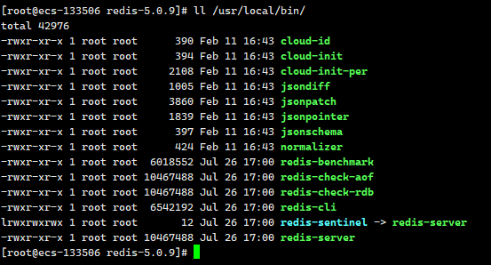

- Table of Contents
{:toc .large-only}


### 下载Redis

从redis 官网下载你想要的版本

https://download.redis.io/releases/

```shell
# 安装wget
yum install –y wget
wget https://download.redis.io/releases/redis-5.0.9.tar.gz
```

解压到`/usr/local`

```shell
tar -xvf redis-5.0.9.tar.gz -C /usr/local/
```


### 开始安装

####  1. 安装编译

安装编译环境c++

```shell
yum install -y gcc-c++ 
gcc -v
```

进入到解压的redis源码目录


```shell
cd /usr/local/redis-5.0.9/
```

编译安装

```shell
make
make install
```

安装后就可以在 `/usr/local/bin`下查看可执行文件




#### 2. 设置配置文件

复制配置文件

```shell
mkdir -p /etc/redis/
cp /usr/local/redis-5.0.9/redis.conf /etc/redis/redis.conf
```

修改配置文件

```shell
vim /etc/redis/redis.conf
```

```shell
# file: '/etc/redis/redis.conf'
# 修改下列配置

bind 0.0.0.0
port 6379
daemonize yes  # 守护进程
```

然后按`esc` 输入`:wq`保存文件。

设置执行权限

```shell
sudo chmod 755 /etc/redis/redis.conf
```

#### 3. 启动服务验证配置

```shell
cd /etc/redis/
redis-server redis.conf
```


连接redis 测试

```shell
# client 连接服务
redis-cli
```


关闭redis服务

```shell
redis-cli shutdown
```


#### 4. 设置服务

```shell
vim /usr/lib/systemd/system/redis.service
```

```shell
# file: '/usr/lib/systemd/system/redis.service'
[Unit]
Description=Redis
After=network.target

[Service]
Type=forking
ExecStart=/usr/local/bin/redis-server /etc/redis/redis.conf
ExecStop=/usr/local/bin/redis-cli shutdown
PrivateTmp=true
 
[Install]
WantedBy=multi-user.target
```

重新加载系统服务配置

```shell
systemctl daemon-reload
```
加入开机启动

```shell
systemctl enable redis
```
启动服务

```shell
systemctl start redis
```

查看运行状态

```shell
systemctl status redis
```

### 尝试设置集群

#### 1. 设置节点0

创建集群节点配置文件

```shell
cd /etc/redis
mkdir nodes-7000
cp redis.conf nodes-7000/7000.conf
```

编辑节点配置

```shell
vim nodes-7000/7000.conf
```
修改以下配置项
```shell
# file: '/etc/redis/nodes-7000/7000.conf'
port 7000

pidfile /var/run/redis_7000.pid
dir /etc/redis/nodes-7000/

appendonly yes

cluster-enabled yes
cluster-config-file nodes-7000.conf
cluster-node-timeout 15000
```

#### 2. 设置节点1

复制节点1的配置文件

```shell
cp -r nodes-7000 nodes-7001
mv nodes-7001/7000.conf nodes-7001/7001.conf
```

编辑节点2配置

```shell
vim nodes-7001/7001.conf
```

修改以下配置项

```shell
# file: '/etc/redis/nodes-7001/7001.conf'
port 7001

pidfile /var/run/redis_7001.pid
dir /etc/redis/nodes-7001/

appendonly yes

cluster-enabled yes
cluster-config-file nodes-7001.conf
cluster-node-timeout 15000
```

#### 3. 依次设置节点 2,3,4,5

其余节点重复上面 第二步骤 依次设置剩下节点

最少要设置6个节点才可以搭建集群

#### 4. 启动节点

依次启动redis节点服务

```shell
redis-server nodes-7000/7000.conf
redis-server nodes-7001/7001.conf
redis-server nodes-7002/7002.conf
redis-server nodes-7003/7003.conf
redis-server nodes-7004/7004.conf
redis-server nodes-7005/7005.conf
.....
```
启动之后效果


#### 5. 启动集群服务

```shell
redis-cli --cluster create 0.0.0.0:7000 0.0.0.0:7001 ... --cluster-replicas 1
```

```shell
[root@VM-4-16-centos redis]# redis-cli --cluster create 0.0.0.0:7000 0.0.0.0:7001 0.0.0.0:7002 0.0.0.0:7003 0.0.0.0:7004 0.0.0.0:7005 --cluster-replicas 1
>>> Performing hash slots allocation on 6 nodes...
Master[0] -> Slots 0 - 5460
Master[1] -> Slots 5461 - 10922
Master[2] -> Slots 10923 - 16383
Adding replica 0.0.0.0:7004 to 0.0.0.0:7000
Adding replica 0.0.0.0:7005 to 0.0.0.0:7001
Adding replica 0.0.0.0:7003 to 0.0.0.0:7002
>>> Trying to optimize slaves allocation for anti-affinity
[WARNING] Some slaves are in the same host as their master
M: f375a4e873071af97dcdba309e407d92944c4f03 0.0.0.0:7000
   slots:[0-5460] (5461 slots) master
M: 2ee4c84360dfae472a9d28b48ce5abf6704cbf25 0.0.0.0:7001
   slots:[5461-16383] (5462 slots) master
M: 79af12c162657b5d82ea876a967b153ad16e51b5 0.0.0.0:7002
   slots:[10923-16383] (5461 slots) master
S: 3ddde900fafb97e36698933c50a6db74e1d3f1ce 0.0.0.0:7003
   replicates 2ee4c84360dfae472a9d28b48ce5abf6704cbf25
S: b5643344e2907edcd1a2ad1c4f21f5201829a0be 0.0.0.0:7004
   replicates 79af12c162657b5d82ea876a967b153ad16e51b5
S: 270f60da1888936e626ff32235a3fdcfa9703359 0.0.0.0:7005
   replicates f375a4e873071af97dcdba309e407d92944c4f03
Can I set the above configuration? (type 'yes' to accept): yes
>>> Nodes configuration updated
>>> Assign a different config epoch to each node
>>> Sending CLUSTER MEET messages to join the cluster
Waiting for the cluster to join
.....
>>> Performing Cluster Check (using node 0.0.0.0:7000)
M: f375a4e873071af97dcdba309e407d92944c4f03 0.0.0.0:7000
   slots:[0-5460] (5461 slots) master
   1 additional replica(s)
S: 270f60da1888936e626ff32235a3fdcfa9703359 127.0.0.1:7005
   slots: (0 slots) slave
   replicates f375a4e873071af97dcdba309e407d92944c4f03
S: 2ee4c84360dfae472a9d28b48ce5abf6704cbf25 127.0.0.1:7001
   slots: (0 slots) slave
   replicates 3ddde900fafb97e36698933c50a6db74e1d3f1ce
S: b5643344e2907edcd1a2ad1c4f21f5201829a0be 127.0.0.1:7004
   slots: (0 slots) slave
   replicates 79af12c162657b5d82ea876a967b153ad16e51b5
M: 3ddde900fafb97e36698933c50a6db74e1d3f1ce 127.0.0.1:7003
   slots:[5461-10922] (5462 slots) master
   1 additional replica(s)
M: 79af12c162657b5d82ea876a967b153ad16e51b5 127.0.0.1:7002
   slots:[10923-16383] (5461 slots) master
   1 additional replica(s)
[OK] All nodes agree about slots configuration.
>>> Check for open slots...
>>> Check slots coverage...
[OK] All 16384 slots covered.
```

#### 6. 验证集群

连接集群任意节点 一定要加`-c`

```shell
redis-cli -h 192.24.54.1 -p 6379 -c
```

```shell
[root@VM-4-16-centos redis]# redis-cli -p 7000 -c
127.0.0.1:7000> set name xiaoming
-> Redirected to slot [5798] located at 127.0.0.1:7001
OK
127.0.0.1:7001> get name
"xiaoming"
127.0.0.1:7001> 
```

新增key 的时候会自动跳转节点进行存储

